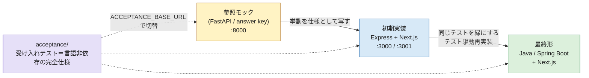
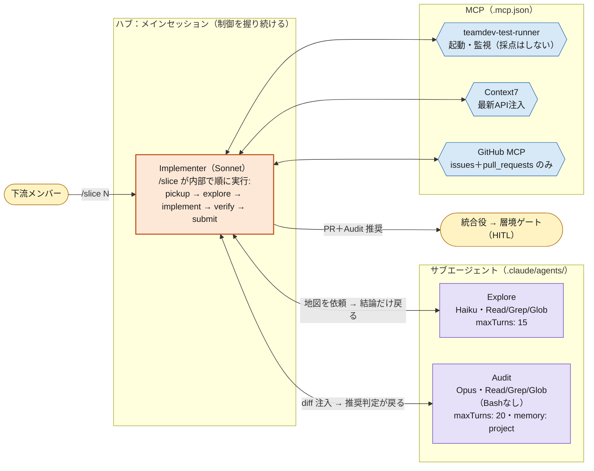
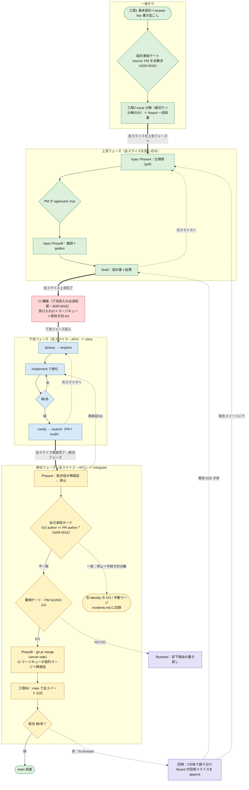

# M-team AIアーキテクチャ資料

> **この資料の位置づけ**：計画書 v2.6 からアーキテクチャ部分を抜き出した説明資料。
> 正本は `CLAUDE.md`（憲法）／`docs/adr/`（決定）／`docs/playbook.md`（手順）／計画書（判断と根拠）。
> 本資料と食い違ったら正本が正。

---

## 1. 全体像：何を作っているか

Repo Base（`staff-report-system`＝参照モック / answer key）の挙動を、AI駆動チーム開発で
**TypeScript (Express) + Next.js** に再実装し、最終的に **Java/Spring** へ一括移行する。

**第一目的は機能ではなく「再現可能な型（方法論）」の確立**。コードは捨てても、
受け入れテスト・運用ルール・`.claude/` 一式が言語非依存の資産として残る設計。



**キモは `acceptance/`**：ブラックボックス受け入れテスト（実 HTTP + Playwright E2E。ADR-0001）が
そのまま Java 移行の完全仕様になる。だから read-only で厳重に守る。

---

## 2. 設計原理：Agent = Model + Harness

エージェントの品質はモデルではなく**ハーネス（枠組み）**で決まる、という思想（Fowler）。
M-team のハーネスは**三層モデル**で安全を積み上げる。

| 層 | 実体 | 性質 |
|---|---|---|
| **宣言**（advisory） | CLAUDE.md・スライス指示書・skills の指示文 | 従うかは確率的。「お願い」 |
| **実行時強制**（deterministic） | hooks（exit 2 ブロック）・permissions deny・tools 制限 | 従わない選択肢がない |
| **事後検証**（CI） | ブランチ保護・pre-commit・CI path ガード・テスト | エージェント外の最終防衛線 |

原則は「**宣言と機械的強制のペア設計**」。宣言単体の遵守率は低い。
破られ続けるルールは hook に昇格させる（2ストライク → 書く → それでも破られたら hook/CI へ）。

`acceptance/` の保護だけは**三層すべて**で張る（宣言＋protect-paths hook＋CI path ガード）
——それだけ重要な不変条項（ADR-0001）。

---

## 3. リポジトリ構造

```
（モノレポ）
├── CLAUDE.md            ← 憲法。全エージェントが毎回読む（repo ルート。.claude/ の中ではない）
├── CONTEXT.md           ← 用語の正本
├── .mcp.json            ← MCP 接続（repo ルート）。clone で自動配布
├── .claude/
│   ├── skills/          ← スラッシュコマンドの実体（/slice ほか）
│   ├── agents/          ← Explore・Audit のサブエージェント定義
│   └── settings.json    ← hooks・permissions deny
├── backend/             ← Express。router → service → repository の一方向のみ（ADR-0011）
├── frontend/            ← Next.js (App Router)
├── acceptance/          ← 受け入れテスト＋golden/。read-only（spec/* ブランチのみ書込可）
├── reference-mock/      ← 参照モック（answer key）。vendor 済み。read-only（ADR-0005）
├── tools/teamdev-test-runner-mcp/  ← アプリ起動・監視 MCP（採点はテストFW）
└── docs/
    ├── playbook.md      ← 手順の正本
    ├── adr/             ← 決定の正本
    ├── slices/          ← スライス指示書の正本（issue はポインタ。ADR-0006）
    └── metrics/         ← KPI・ゲート記録
```

### backend の構造規約（ADR-0011）

Spring と 1:1 の構造を Express 上に**規約＋カスタム lint（CI）**で強制する。

```
backend/src/<feature>/
├── <feature>.router.ts       ← Spring: @RestController
├── <feature>.service.ts      ← Spring: @Service
├── <feature>.repository.ts   ← Spring: @Repository
└── <feature>.schema.ts       ← Spring: DTO + Bean Validation
```

依存は **router → service → repository の一方向のみ**。逆流・飛び越しは CI の lint が fail させる。
`app.ts` が唯一の合成ルート。AI 呼び出しは `Summarizer` 抽象化層を必ず経由（プロバイダー非依存）。

---

## 4. エージェント構成（3体＋人間の帽子1つ）



| | モデル | tools | 役割 | 設計意図 |
|---|---|---|---|---|
| **Explore** | Haiku | Read/Grep/Glob | 地図を返す。結論だけ | 安いモデルで探索を済ませ、メインのコンテキストを汚さない |
| **Implementer** | Sonnet（既定） | 通常 | 実装して緑にする | 作業量最大なので Sonnet 固定。定義ファイル無し（メインセッション） |
| **Audit** | Opus | Read/Grep/Glob（**Bash なし**） | diff を仕様と照合し推奨判定 | 生成と評価の分離。出力が短く判断価値が高い所にだけ Opus を温存 |
| **Harness-Keeper** | ―（人間の帽子） | ― | 却下理由の書き戻し（/flywheel）・棚卸し | 担い手は AIアーキ。憲法の書き換えは PM 承認 |

### 制御モデルの3原則

1. **ハブ＆スポーク**：制御は常にメインセッションが握る。サブエージェントは呼ばれて結論を返す使い捨ての作業員（関数呼び出しと同じ）。エージェント同士のバトンリレー（swarm 型）は Pro 枠と制御可能性の両面で不採用。
2. **既定は直列**：並列は Pro 枠を壊す（マルチエージェントは通常の約15倍のトークン消費）。`CLAUDE_CODE_DISABLE_BACKGROUND_TASKS=1` を標準セットアップに含める。
3. **生成と評価は別エージェント**：緑 ≠ 仕様充足。Audit にはフレッシュコンテキスト（diff と基準だけ。実装の経緯・言い訳を見せない）。

---

## 5. skills（スラッシュコマンド）の設計

呼び出し口は3層。**下流が触るのはスラッシュだけ**。

| 層 | 実体 | 下流が直接触るか |
|---|---|---|
| スラッシュ（skills） | `.claude/skills/<名前>/SKILL.md` | **これだけ** |
| サブエージェント | `.claude/agents/*.md` | 触らない（スキルが内部起動） |
| MCP ツール | runner / Context7 / GitHub | 触らない（内部で呼ばれる） |

### 自作 skills（オーケストレーション層＝薄いラッパー）

| コマンド | 誰 | 何をするか |
|---|---|---|
| `/board` | 全員 | スライスレジストリ（`docs/slices/README.md`）の採番・一覧・現在地。**番号不変・append-only**（ADR-0013） |
| `/spec <slice>` | PM | 2フェーズ：Phase A grill で仕様表 → **PM が `approved: true`** → Phase B `acceptance/` へ翻訳＋golden（ADR-0012） |
| `/brief <slice>` | 上流 | スライス指示書（6項目）＋issue 起票（本文はポインタのみ。ADR-0006） |
| `/slice <issue>` | 下流 | **幸福経路**。pickup→explore→implement→verify→submit を1本で |
| `/pickup` `/explore` `/implement` `/verify` `/submit` | 下流 | 個別コマンド＝**復旧経路**（途中から叩き直せる再開可能性が設計条件） |
| `/integrate <PR>` | 統合役 | 2フェーズ：Phase A 再検証 → **PM GO** → Phase B `gh pr merge`＋総合テスト（ADR-0014） |
| `/flywheel` | Harness-Keeper | 却下理由をチーム共有知へ書き戻す草案 |

### 実装規範（抜粋）

- 人間のタイミングで走るものは `disable-model-invocation: true`（勝手な `/submit` 発火を仕様で封じる）
- SKILL.md は 100 行目標・**禁止事項は冒頭に**（compaction で先頭約5,000トークンしか持ち越されないため)
- 壊れやすい操作（runner 起動・テスト実行）は低自由度で固定、判断業務は高自由度
- 既製は mattpocock/skills（`/tdd`・`/diagnose` ほか。vendor SHA は各 PROVENANCE.md）。**丸ごと導入せず部品抜粋**が基本方針（GSD アーカイブ事件＝サプライリスクの実例）

---

## 6. MCP 構成

| MCP | 役割 | 備考 |
|---|---|---|
| **teamdev-test-runner**（自作） | アプリ起動・監視（bootCommand → ready 待ち → ログ/停止） | **採点はしない**。採点は `@playwright/test`。`.mcp.json` 同梱で clone＝入手 |
| **Context7** | ライブラリ最新 API 注入 | Pro 枠最大の節約策。存在しない API のリトライを潰す |
| **GitHub MCP**（remote/OAuth） | issue/PR | **toolsets は issues＋pull_requests に限定**。main の防御はブランチ保護が正本 |

後追い：Playwright MCP（診断専用）→ DBHub（read-only DSN 必須）→ Sentry。
セキュリティ規範：ツール注釈に強制力なし（実体側で read-only 担保）／トークンは環境変数／
未使用サーバー無効化／ツール総数 ~40 以下／導入は公式レジストリのみ。

---

## 7. 開発フロー（工程とゲート）

**進め方はフェーズ型大バッチ（ADR-0016）。** 縦切りで1本を端まで通すのではなく、各フェーズ（上流→下流→統合）を**全スライスに対して回し切ってから**次フェーズへ移る。縦切りは issue「分解」として維持し、撤回したのは「1本を端まで通すフロー」の方。太線＝フェーズ移行（全スライス完了が条件）、赤＝CI 構築（下流フェーズ突入の必須前提）。



> **なぜフェーズ型か（ADR-0016）**：per-slice の縦切りフローは1スライスごとに PM→リーダー→実装→統合と役割の帽子を掛け替える。単一アカウント運用（ADR-0015）ではこの帽子替えが毎スライス発生し停滞を生むため、同種作業をまとめるフェーズ型で掛け替え回数を最小化する。代償（型・ハーネス欠陥の早期露見）は限定的——`source: reference-mock` は工程4 で自己検証、`source: PM` は設計凍結ゲートが先に潰し、残る合成バグは工程9b/CI が捕まえる。

### ブランチとゲートの設計

- 書込権は**ブランチ名で判定**（ADR-0004）：`spec/slice-NN` は `acceptance/` 可・実装不可、`feature/slice-NN` はその逆。hook＋CI の両方で強制。
- **全 PR にゲート**、重さは CI が決める（ADR-0007）。`irreversible` ラベル（migration・認可・`acceptance/`）は PM が diff を自分で読む。
- **不可逆操作は統合役の1点に集約**。マージは `gh pr merge`（server-side）——hook もブランチ保護も迂回しない（ADR-0014）。
- **単一アカウント時の自己承認ガード（ADR-0015）**：demo は単一 GitHub アカウントで PR 作成者・GO 判定者・マージ実行者を identity で分離できない。`/integrate` が GO/approve の author と PR の author を突き合わせ、**一致したら Phase B（マージ）へ進まず停止**（「自分の勢いで自分の PR を通す」経路を機械で塞ぐ）。手続き的分離のまま進めた PR は `docs/metrics/incidents.md` に記録。identity 水準の機械強制は多アカウント/CI 導入まで保留。
- 工程9b の赤は **fix-forward**（巻き戻さない）。既存 E2E が赤 → `/brief`、テストに穴 → `/spec` に振り分け。
- **CI マージキュー（下流フェーズ突入の必須前提・ADR-0016）**：大バッチでは全 feature PR が統合フェーズ末尾に一斉到着し、マージのたびに残 PR が古くなる（Require branches up to date）。この直列マージ＋再検証は **CI マージキューが担う**（ADR-0016。だから CI が下流フェーズ突入の前提）。

---

## 8. hooks（決定論レイヤー）の実装

| hook | 何をするか |
|---|---|
| **PreToolUse (Bash)** | 危険コマンド（push to main・force・reset --hard・rm -rf・migration）を exit 2 でブロック。**ブランチ判定**：commit/push は `feature/slice-*` / `spec/slice-*` のみ許可（fail-closed） |
| **PreToolUse (Edit/Write)** | protect-paths：`acceptance/`・`.env`・`CLAUDE.md` への書込ブロック（ブランチで層判定） |
| **PostToolUse** | 非ブロッキング feedback：`tsc --noEmit`・lint・関連テストのエラーを注入 |
| **Stop** | 受け入れテスト未通過なら完了扱いにしない。**8連続ブロックで override される上限付きゲート**——最終担保は統合役の再検証 |
| **PostCompact** | compact 後に禁止事項を再注入（compaction の「指示忘れ」対策） |

実装の注意：exit 2＝ブロック（stderr がモデルに返る）、**exit 1 は非ブロッキング**（典型バグ）。
ブロック時の stderr に修正指示を書く（良性のプロンプトインジェクション）。
hook I/O は `logs/` に JSON 永続化（Harness-Keeper の監査証跡）。

---

## 9. 役割と所有マップ

| 誰 | 何をする |
|---|---|
| **PM** | 要件・仕様表・合成フィクスチャの正本。**層境ゲート GO/NO-GO**。CLAUDE.md の中身を承認 |
| **AIアーキテクト** | `.claude/` の箱・hooks・エージェント・skills。`/spec` を回す。Harness-Keeper 兼務 |
| **リーダー** | 下流の窓口（一次質問）、枠と禁止事項の文言、救援の記録。PM の代理（記録必須） |
| **実装メンバー（下流）** | feature ブランチで緑にして PR。main に触らない |
| **統合役（下流・中級）** | `/integrate` で再検証＋マージ（不可逆操作の1点集約） |

**箱（仕組み）＝AIアーキ、中身（文言）＝PM/リーダー**の線引き。AIアーキは仕様判断をしない。
`.claude/` 一式は git 管理し、変更は PR レビュー対象。

---

## 10. KPI と Flywheel（型を育てる仕組み)

- **北極星＝AFK完走率**：`/slice` 起点から緑＋PR まで人の救援なしで到達した割合。直近5スライスの移動平均が右肩上がりであること。暫定ゲート ≥70%（slice-01〜05 実測後に較正）。
- 計測は `/submit` が1行記録（救援有無/再作成回数/枠消費/差し戻し理由）を `docs/metrics/` に自動追記。
- 指標割れは罰でなく **Flywheel の観察項目**。原因は必ず「スライス設計の欠陥」か「ハーネスの欠陥」に2分類してから対策。
- CLAUDE.md への書き戻しは 2ストライクルール → 破られ続けたら hook 昇格、の階段。

---

## 参照

- 計画書正本：Obsidian Vault `M-team/AIアーキ/正本/M-team開発計画書_v2.md`（v2.6）
- 憲法：`CLAUDE.md`／手順：`docs/playbook.md`／決定：`docs/adr/`（0001, 0004〜0017）
- 理論的背景：Fowler「Harness engineering」「Feedback Flywheel」、Anthropic「Effective context engineering」、OpenAI「Harness engineering」